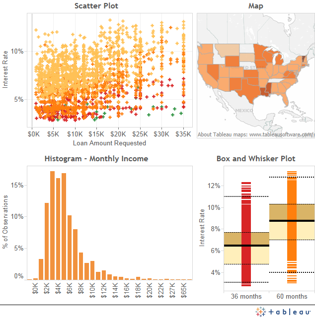

# 100-DAYS-OF-ML-CODE
100 Days of ML coding

code:[ here](https://github.com/Piyush11101/100-DAYS-OF-ML-CODE/tree/master/Code)

dataset:[ here ](https://github.com/Piyush11101/100-DAYS-OF-ML-CODE/tree/master/Datasets)

# Day 1
# Data Preprocessing
1) Importing .csv Dataset using pandas library
2) Fixing the missing values using sklearn(0.22.1) library SimpleImputer
3) Doing labelEncoding and OneHotEncoding using sklearn.preprocessing library
4) Splitting of dataset into train and test using test_train_split function of sklearn.model_selection library
5) Standardization of data using preprocessing.StandardScaler() from sklearn library

# Day2
# Simple Linear Regression

Simple linear regression is a statistical method that allows us to summarize and study relationships between two continuous (quantitative) variables:

One variable, denoted x, is regarded as the predictor, explanatory, or independent variable.
The other variable, denoted y, is regarded as the response, outcome, or dependent variable.

1) Data preprocessing
2) Applying Simple Linear Regression Model
3) Predicting the result
4) Visualization

# Day3
# Multiple Linear Regression

Multiple linear regression (MLR), also known simply as multiple regression, is a statistical technique that uses several explanatory variables to predict the outcome of a response variable. The goal of multiple linear regression (MLR) is to model the linear relationship between the explanatory (independent) variables and response (dependent) variable.

1) Data Preprocessing
2) Avoiding Dummy Variable Trap
3) Splitting the dataset into the Training set and Test set
4) Fitting Multiple Linear Regression to the Training set
5) Predicting the test set result

# Day4
# Logistic Regression

Logistic regression is a statistical model that in its basic form uses a logistic function to model a binary dependent variable, although many more complex extensions exist. In regression analysis, logistic regression (or logit regression) is estimating the parameters of a logistic model (a form of binary regression).

1) Data Preprocessing
2) Splitting the Data
3) Feature Scaling
4) Fitting Logistic Regression to the Training set
5) Predicting the Test set results
6) Evaluating The Predection

# Day5
Since logistic regression is a very special and important algorithm in machine learning so I decided to learn the geometry behind logistic regression deeply. And also I posted my first blog on medium about "Geometrical intution of Logistic Regression". You can visit the blog [here](https://medium.com/@piyushgarguno/understanding-of-logistic-regression-with-geometrical-intuition-part-i-9ec7ec8162b5?sk=6a84a9bd3237758a60b85fcf8870ef57).

And in coming days, it will be about logistic regression only, will try to explore the mathematics behind the algorithm.

# Day6
Today I read about the importance of sigmoid function in logistic regression. Sigmoid function is an activation function which squashes the input which is greater than 1 into the value between 0 and 1. Sigmoid function plays a very important role in Logistic Regression. You can check my blog on "Importance of sigmoid function in Logistic Regression" on [Medium](https://medium.com/@piyushgarguno/importance-of-sigmoid-activation-function-in-the-logistic-regression-model-284345e5f8dc)

# Day7
Today I read about loss function of Logistic regression in depth and today was a last day for logistic regression, I have gotten enough knowledge about logistic regression, will be starting with different algorithm from tomorrow.

# Day8
Today I read about a different machine learning algorithm SVM(Support Vector Machine). I was able to get only the introductory part today due to some technical issues and from now on it will be theory first and then its implementation, so it might take two or three days for an algorithm but it is really necessary to learn each and every algorithm properly.

# Day9
I spent a lot of time learning geometrical intuition of SVM today and already started writing an article on it. Will be posting it tomorrow. 

# Day10
Today I went deep into SVM. Got a very good intuition about Soft margin SVM and Hard margin SVM and the maths behind them.My blog is in progress and it will be completed by tomorrow by sure.

# Day11
Done with my blog on SVM.You can check it out over [here](https://medium.com/@piyushgarguno/a-mathematical-view-of-svm-support-vector-machine-a8d0775e058b?sk=45f343d75ac385ee819bd28a3df97552). I will upload the code tomorrow.

# Day12

Today I learn about EDA(Exploratory Data Analysis). Exploratory Data Analysis refers to the critical process of performing initial investigations on data so as to discover patterns,to spot anomalies,to test hypothesis and to check assumptions with the help of summary statistics and graphical representations.

I am working on a dataset where I will be performing EDA and will be getting meaningful observations on it and with the help of those observation we will be able to apply machine learning algorithms on it to get meaningful insights.

# Day13

Completed my EDA on kaggle dataset "Housing Price prediction". It is a great problem for anyone starting his preparation towards datascience. you can check my notebook. There is still too much work to do in this notebook that's why i have not made it open.
